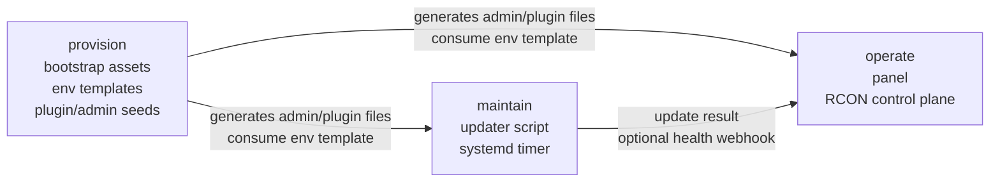

# Architecture

`cs2-server-ops` is one product with three module boundaries:

- `provision`: bootstrap a server runtime and supporting assets
- `maintain`: keep an existing server updated safely
- `operate`: control and monitor running servers

## Module Relationships

## Why The Split Exists

Operators think in lifecycle stages, but the implementation still needs clear seams:

- bootstrap assets should not drag in a web app
- the updater should remain usable on a plain host
- the panel should not become a host orchestration daemon

## Source Anchors

- `operate` comes from `02_mid_cs2-modded-server-panel`
- `maintain` comes from `03_low_cs2-auto-update`
- `provision` is a curated successor layer derived from the archived egg’s bootstrap ideas, not its shipping runtime model

## Explicit Exclusions

- archived audit workspaces
- local temp data, DB state, screenshots from ad-hoc verification, and generated bundles
- Pterodactyl-first runtime packaging as the default deployment path

## Publication Intent

This repo is intended to publish with `dev` as the authoritative branch.
